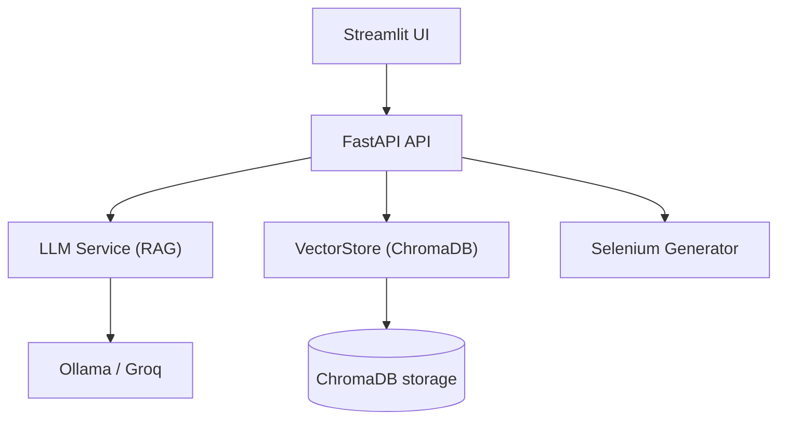
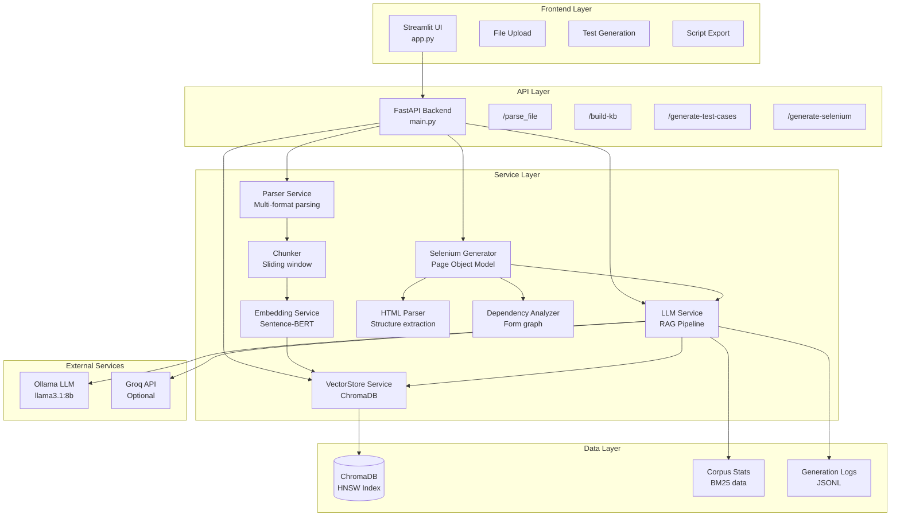

# QA Agent

QA Agent is a local-first tool that transforms project documentation into
grounded JSON test cases and Selenium scripts using embeddings +
local/cloud LLMs (RAG pipeline).

Contents

- Architecture
- Tech Stack
- Setup Instructions
- Usage Guide
- Algorithms & Techniques
- API Reference
- Support

## Main Architecture (compact)



## System Architecture Overview



## Tech Stack

### Backend

- **FastAPI** - Modern async Python web framework
- **ChromaDB** - Vector database for embeddings (HNSW index)
- **Sentence-BERT** - all-MiniLM-L6-v2 (384-dim embeddings)
- **Ollama** - Local LLM inference (llama3.1:8b) / Groq Support
- **PyMuPDF** - PDF text extraction
- **BeautifulSoup** - HTML/XML parsing

### Frontend

- **Streamlit** - Interactive web UI with file upload

### Automation

- **Selenium WebDriver** - Browser automation framework
- **webdriver-manager** - Automatic driver downloads

### Infrastructure

- **Docker** - Containerized Ollama service
- **SQLite** - ChromaDB metadata storage

---

## Setup Instructions

### Prerequisites

- **Python**: 3.9 or higher
- **Docker**: For Ollama LLM service
- **RAM**: 8GB minimum (16GB recommended)
- **Disk**: 5GB for models and dependencies

### 1. Clone Repository

```bash
git clone https://github.com/HarshitPG/QA_Agent.git
cd QA_Agent
```

### 2. Create Virtual Environment

```bash
# Windows
python -m venv venv
venv\Scripts\activate

# Linux/Mac
python3 -m venv venv
source venv/bin/activate
```

### 3. Install Dependencies

```bash
pip install -r requirements.txt
```

This installs:

- FastAPI, Uvicorn (backend)
- Streamlit (frontend)
- sentence-transformers (~500MB with model)
- chromadb
- selenium, webdriver-manager
- pymupdf, beautifulsoup4, markdown

### 4. Start Ollama Service

```bash
docker-compose up -d
```

Wait ~10 seconds for startup, then pull the model:

```bash
docker exec qa-agent-ollama ollama pull llama3.1:8b
```

**Model Download**: ~4.7GB, takes 5-15 minutes depending on internet speed.

Verify it's running:

```bash
docker exec qa-agent-ollama ollama list
# Should show: llama3.1:8b
```

### 5. Configure Environment (Optional)

Create `.env` file in project root:

```bash
# LLM Configuration
LLM_PROVIDER=ollama
OLLAMA_URL=http://localhost:11434
OLLAMA_MODEL=llama3.1:8b
GENERATION_TEMPERATURE=0.2

# To use Groq, set LLM_PROVIDER=groq and add your API key below
GROQ_API_KEY=
GROQ_MODEL=llama-3.3-70b-versatile
GROQ_BASE_URL=https://api.groq.com/openai/v1

# Chunking Configuration
CHUNK_SIZE=1000
CHUNK_OVERLAP=200
MAX_TEXT_SIZE=5000000
```

### 6. Start Backend

```bash
python -m uvicorn backend.main:app --port 8000
```

**Expected Output**:

```
INFO:     Uvicorn running on http://127.0.0.1:8000
INFO:     Application startup complete.
```

Test backend:

```bash
curl http://localhost:8000/
# Response: {"status":"Backend running"}
```

### 7. Start Frontend

**In a new terminal** (activate venv first):

```bash
streamlit run frontend/app.py
```

**Expected Output**:

```
You can now view your Streamlit app in your browser.
Local URL: http://localhost:8501
```

Open browser to `http://localhost:8501`

---

## Usage Guide

### Phase 1: Build Knowledge Base

1. Navigate to **Phase 1: Build Knowledge Base** in the UI
2. Click **"Browse files"** and select documentation:
   - Product specs (PDF, Markdown)
   - API documentation (JSON)
   - UI guidelines (TXT, HTML)
   - Validation rules
3. Click **"📚 Build Knowledge Base"**
4. Wait for processing (~10-30 seconds for typical docs)
5. See success message: "✅ Knowledge Base Built Successfully!"

**Example Documents** (included in `supportDocs/`):

- `product_specs.md` - Feature descriptions, pricing
- `api_endpoints.json` - REST API schema
- `validation_rules.txt` - Input constraints
- `ui_ux_guide.txt` - UI component descriptions

### Phase 2: Generate Test Cases

1. In **Phase 2: Test Case Generation**:
2. Enter a prompt in the text area:
   ```
   Generate all positive and negative test cases for the discount code feature, including edge cases for expired codes and invalid formats.
   ```
3. **(Optional)** Upload HTML file for form dependency analysis
4. **(Optional)** Enter feature name (e.g., "Discount Code System")
5. Adjust **Context chunks** slider (default: 10)
6. Click **"🤖 Generate Test Cases"**
7. Wait 60-180 seconds (shows progress bar)
8. View generated test cases with:
   - 🟢 Positive / 🔴 Negative indicators
   - 🔥 High / ⚡ Medium / 📌 Low priority badges
   - ⚠️ Review warnings (if no verbatim evidence found)
   - Source documents (grounding)
9. Download as JSON or Markdown

**Example Output**:

```
🟢 TC-001: Discount Code System 🔥

Test Type: positive
Priority: high
Scenario: Apply valid discount code SAVE10 at checkout
Test Steps:
  1. Navigate to checkout page
  2. Enter product in cart
  3. Click "Apply Discount Code" field
  4. Enter code SAVE10
  5. Click "Apply" button
Expected Result: 10% discount applied, total reduced by correct amount
Grounded In: product_specs.md
```

### Phase 3: Generate Selenium Script

1. In **Phase 3: Selenium Script Generation**:
2. Upload the **HTML file** you want to automate
3. Paste **test cases** (JSON from Phase 2) into text area
4. Select **Testing Framework**: pytest or unittest
5. Select **Target Browser**: Chrome, Firefox, or Edge
6. Check **"Include Knowledge Base Context"** (recommended)
7. Click **"⚡ Generate Advanced Script"**
8. Wait ~30 seconds
9. View generated Python script with:
   - Page Object Model classes
   - Locators for all HTML elements
   - Test methods mapped from test cases
   - Explicit waits and assertions
10. Click **"📥 Download Script"**

**Generated Script Structure**:

```python
from selenium import webdriver
from selenium.webdriver.common.by import By
from selenium.webdriver.support.ui import WebDriverWait
import pytest

class Page:
    def __init__(self, driver):
        self.driver = driver
        # Locators
        self.discount_code_input = (By.ID, 'promoCode')
        self.apply_button = (By.ID, 'applyBtn')
        self.total_price = (By.ID, 'totalPrice')

    def enter_discount_code(self, code):
        self.driver.find_element(*self.discount_code_input).send_keys(code)

    def click_apply(self):
        self.driver.find_element(*self.apply_button).click()

@pytest.fixture
def driver():
    driver = webdriver.Chrome()
    yield driver
    driver.quit()

def test_tc_001_valid_discount_code(driver):
    page = Page(driver)
    driver.get("file:///path/to/checkout.html")

    page.enter_discount_code("SAVE10")
    page.click_apply()

    total = page.driver.find_element(*page.total_price).text
    assert "10%" in total or "$" in total
```

### Running Generated Tests

```bash
# Install Selenium if not already installed
pip install selenium pytest webdriver-manager

# Run the script
pytest selenium_test_checkout.py -v

# Expected output:
# test_tc_001_valid_discount_code PASSED
# test_tc_002_invalid_discount_code PASSED
# test_tc_003_expired_discount_code PASSED
```

---

## Algorithms & Techniques

```
 1. Retrieval-Augmented Generation (RAG)

 2. Hybrid Ranking (BM25 + Embeddings)

 3. Hallucination Detection

 4. Dependency Graph Analysis

 5. Semantic Element Matching

 6. Token Budget Management

 7. Page Object Model Generation

```

---

## API Reference

### POST /build-kb

**Build knowledge base from uploaded documents**

**Request**:

```http
POST /build-kb
Content-Type: multipart/form-data

files: [File, File, ...]
```

**Response**:

```json
{
  "status": "ok",
  "chunks_indexed": 127
}
```

---

### POST /generate-test-cases

**Generate test cases using RAG pipeline**

**Request**:

```json
{
  "prompt": "Generate test cases for login feature",
  "feature": "Login System",
  "html_content": "<html>...</html>", // Optional
  "top_k": 10
}
```

**Response**:

```json
{
  "test_cases": [
    {
      "test_id": "TC-001",
      "feature": "Login System",
      "test_scenario": "Valid credentials",
      "test_steps": [
        "Navigate to login",
        "Enter username",
        "Enter password",
        "Click submit"
      ],
      "expected_result": "User logged in successfully",
      "test_type": "positive",
      "priority": "high",
      "grounded_in": "api_docs.json"
    }
  ],
  "count": 5,
  "sources": ["api_docs.json", "ui_guide.txt"],
  "llm_provider": "ollama",
  "model": "llama3.1:8b",
  "retrieved_chunks": 10
}
```

---

### POST /generate-selenium

**Generate Selenium script from HTML and test cases**

**Request**:

```json
{
  "html_content": "<html>...</html>",
  "html_filename": "login.html",
  "test_cases": [...],  // From /generate-test-cases
  "framework": "pytest",
  "browser": "chrome",
  "include_kb_context": true,
  "prompt": "login testing"
}
```

**Response**:

```json
{
  "status": "success",
  "script": "from selenium import webdriver\n...",
  "framework": "pytest",
  "browser": "chrome",
  "test_cases_covered": 3,
  "elements_mapped": 15,
  "html_path": "html/test.html",
  "html_url": "file:///path/to/html/test.html"
}
```

## Support

- **Issues**: [GitHub Issues](https://github.com/HarshitPG/QA_Agent/issues)
- **Contact**: p.g.harshit@gmail.com

---
